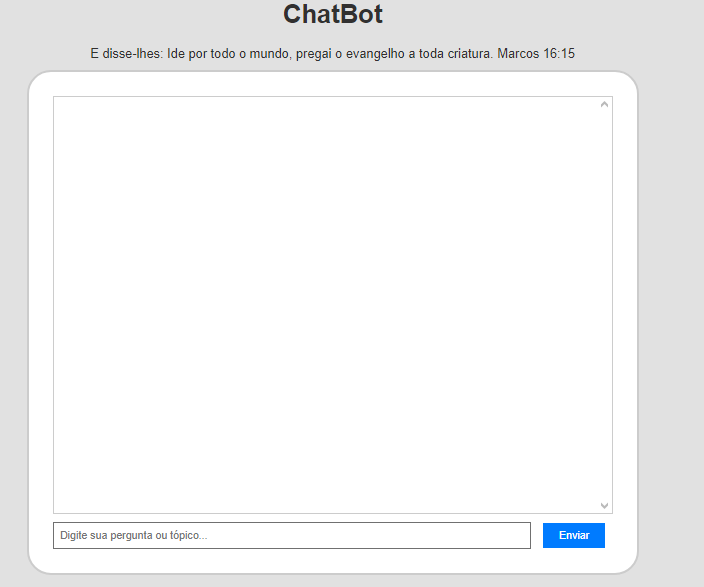

<h1 aling="center"> ChatBot </h1>

<h1 aling="center"> Sobre o projeto </h1>

 O projeto foi criado para pregação do evangelho basta você fazer uma pergunta em seguida IA irá te responder, durante o processo da criação da inteligência artificial não foi possivel adicionar uma API para respodner todos os tipos de perguntas.

Más estou estudando para que isso se torna realidade isso apenas uma versão Beta do ChatBot. Eu espero de coração que vocês gostam. 

Segue a lista das perguntas que pode ser realizada:

<ol>
<li>
1 - fé
2 - Deus
3 - estudo biblico
4 - livros que voce recomenda para o lar
5 - quais os livros da biblia que tem apenas 1 capitulo
6 - quais os livros da biblia que terminam com um ponto de interrogação ?
7 - qual o menor livro da biblia
8 - por que o rei Davi não pode construir um templo para Deus
9 - ual e a unica mulher cuja a idade e mencionada na biblia
</li>
</ol>

Observação: não adintar copiar a pergunta e colar no campo de "pergunta" no campo se vai ter qu digitar para IA pode funcionar.

E disse-lhes: ide por todo mundo, pregai o evangelho a toda criatura. Marcos 16:15
 
